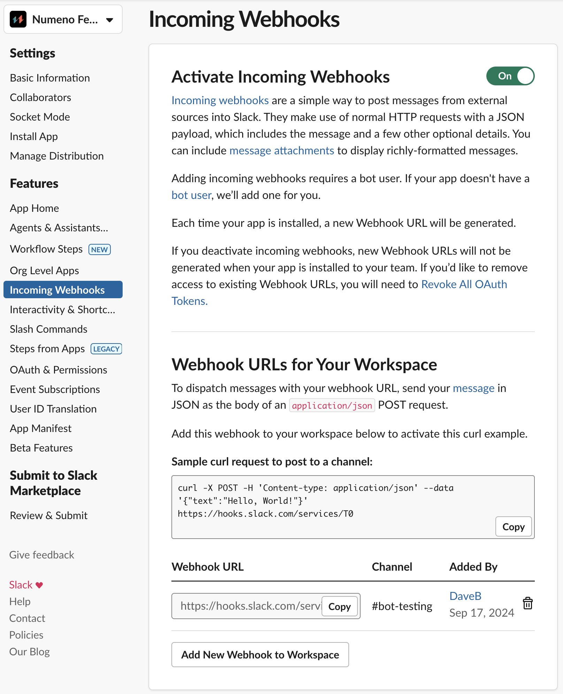
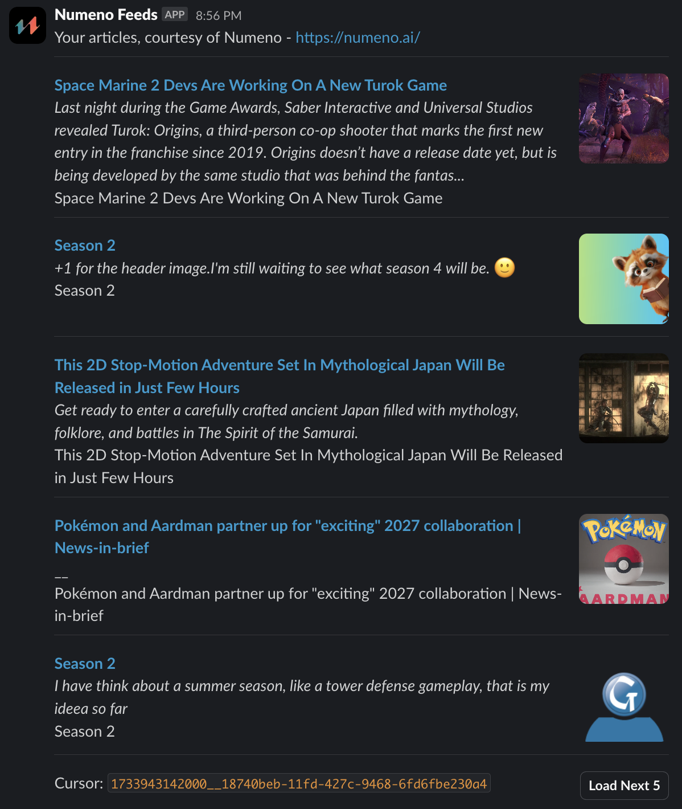

# Numeno Slackbot PHP Plugin

This project implements the backend of a Slackbot command for Numeno Feeds that
fetches articles from a Numeno Article Recommender Feed and publishes them to a
Slack channel. The PHP scripts are designed for a WordPress site, but the
routes can be easily changed for a non-Wordpress host.

# Install Dependencies

This project uses [Composer](https://getcomposer.org/) for managing dependencies in PHP.  After cloinging the repo, install Composer if necesary, then install dependencies:

```sh
$ brew install composer  # Install composer globally on your system.
$ make install           # Install dependencies for this project.
```

# Configure the Slack App

This demo assumes you already have a Slack app. If you're unfamiliar with Slack apps, refer to Slacks's [Quickstart](https://api.slack.com/quickstart) to create a basic Slack app.

|  |  |
| ----------- | --------- |
|  1) Give your Slack app Bot Token Scopes for `commands` and `incoming-webhook`.  You'll also need to give it `channels:join` so that you can activate the app in public channels. |  |
| 2) Create an Incoming Webhook.  Take note of the `Webhook URL`, we'll be adding it to the code in a moment. |   |
| 3) Create a Slash Command - in this example we call it `/articles`. |  |
| 4) Edit the command and point the `Request URL` to match the route in the plugin code.  In our example, we use `https://your-domain.com/wp-json/slackbot/art-rec-v1/articles`.  Adding a `Usage Hint` helps your Slack Workspace members discover they can specify a Numeno Feed ID on the command line to fetch a specific Feed.|  |
| 5) Open the plugin code. Duplicate the file `.env.example` and rename it to `.env`. Populate this new file with values for your setup.  Set `SLACK_WEBHOOK_URL` to the Incoming Webhook URL we created in Step 2. |  |

Zip up the plugin directory containing the new `.env` file, upload it to your Wordpress website's plugin directory, and activate the plugin.

You're now ready to use the Slack App!

# Using the Slack app

In your Slack Workspace, navigate to a public channel and the Slack App to the channel.  Then enter the command `/articles yourFeedIdHere` using a FeedID you created with the Numeno Article Recommender API.

Press the `Load Next 5` Block Kit button to page through the Feed.


